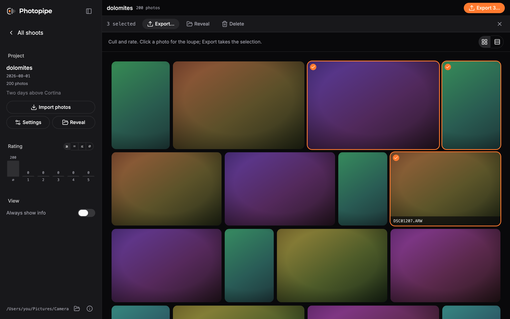
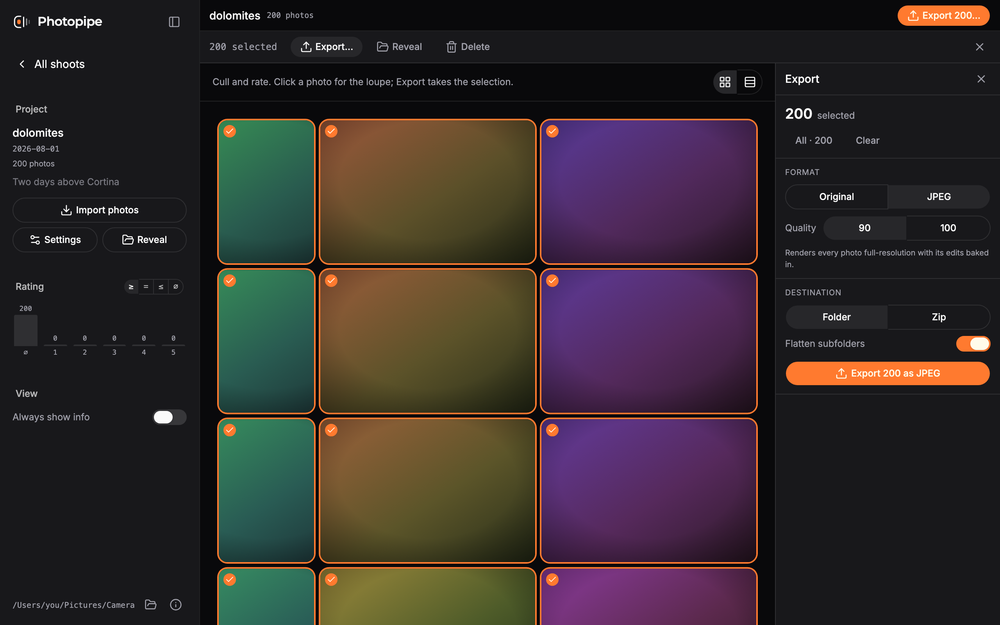
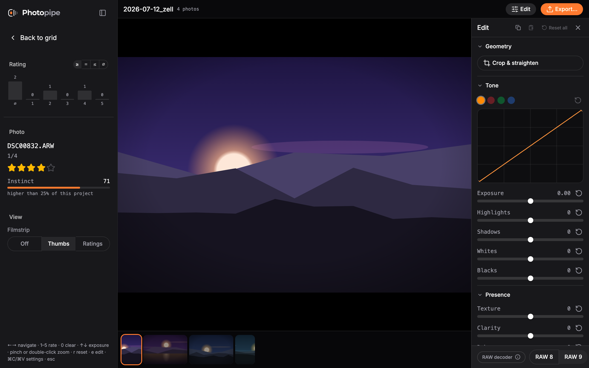

<div align="center">


# Photopipe

Culling and export for photo shoots, on macOS.

</div>

Photopipe is for the part of photography that happens between the shoot and
the delivery: looking at a few hundred raws, deciding which ones are worth
keeping, and getting the keepers out the door.

It is built around one rule: **your folders are the truth.** Photopipe reads
what is on disk and shows it to you. It never maintains a catalogue that can
disagree with reality, and the only files it changes are the ones you ask it
to.



## Install

Requires **macOS 15 (Sequoia) or later** on **Apple Silicon**.

```bash
brew install --cask raphaelmitas/tap/photopipe
```

Or download the DMG from [Releases](https://github.com/RaphaelMitas/photopipe/releases).
Everything is signed and notarized, so it opens with a double-click. There is
nothing else to install: the raw pipeline and the metadata writer ship inside
the app.

Photopipe updates itself. It looks for a new version on launch and offers it;
nothing is downloaded until you say so. The running version and a manual check
live under the ⓘ in the sidebar footer.

## How it works

A project is a folder named `<date>_<name>`. Whatever image files sit inside
it — in subfolders or not — are its photos, shown as one flat set:

```
2026-07-12_zell/
├── DSC00832.ARW
├── kirche/DSC00938.ARW
└── party/DSC01204.jpg
```

Subfolders are yours: sort however you like, the app just walks them and
shows the relative path as part of the name. Every file is its own photo —
an ARW and a JPEG of the same shot are two entries, exactly like on disk.

The app is one surface: browse and rate in the grid, edit in the loupe,
leave through the **Export** button. The sidebar's rating histogram doubles
as the filter — a count per rating, click a bar to narrow.



Export always acts on the selection (quick actions select the filtered set
or everything for you) and offers two formats: **Original** copies the bytes
untouched, **JPEG** renders each photo full-resolution with its edits baked
in, at quality 90 or 100, to a folder or a zip — flat or mirroring your
subfolders, never silently overwriting on a name collision. Jobs run in the
drawer's activity section, where errors stay visible instead of vanishing
with a toast.

### Culling



Click a photo to open it full-bleed. Rate with `1`–`5`, clear with `0`,
navigate with `←`/`→`, adjust exposure with `↑`/`↓`. The exposure is saved
with the photo and baked into JPEG exports.

Ratings and edits are written as XMP: a sidecar next to a raw, embedded in a
DNG or JPEG, the exposure as Lightroom's own `crs:Exposure2012`. Lightroom,
Capture One and Photo Mechanic read the same stars, so nothing you decide
here is locked inside this app.

Hold, or ⌘-click, to start selecting. Then **Export…**, **Reveal in
Finder**, or **Delete** — which means the Trash, sidecar included, never an
unlink.

## Development

```bash
pnpm install
pnpm dev
```

`pnpm dev` builds the Swift core, stages it as the Tauri sidecar
(`apps/desktop/src-tauri/binaries/`), and starts `tauri dev`. Running
`tauri dev` directly fails until the sidecar is staged once:
`./scripts/build-core.sh`.

You need Rust, Swift (Xcode command line tools) and Node 24. `exiftool` comes
from Homebrew in development and is bundled for releases.

```bash
pnpm check                      # lint and format
cd core && swift test           # the Swift core
cd apps/desktop && pnpm test    # component tests
cd apps/desktop && pnpm e2e     # browser e2e against a mocked core
./scripts/smoke-bundle.sh       # prove a built .app is self-contained
```

Releases are cut with `pnpm release [patch|minor|major]`, which opens a PR;
merging it builds, signs, notarizes and publishes. See
[docs/engineering.md](docs/engineering.md).

## Docs

- [docs/design.md](docs/design.md) — what the app is, and the decisions behind it
- [docs/engineering.md](docs/engineering.md) — stack, testing, CI, releases
