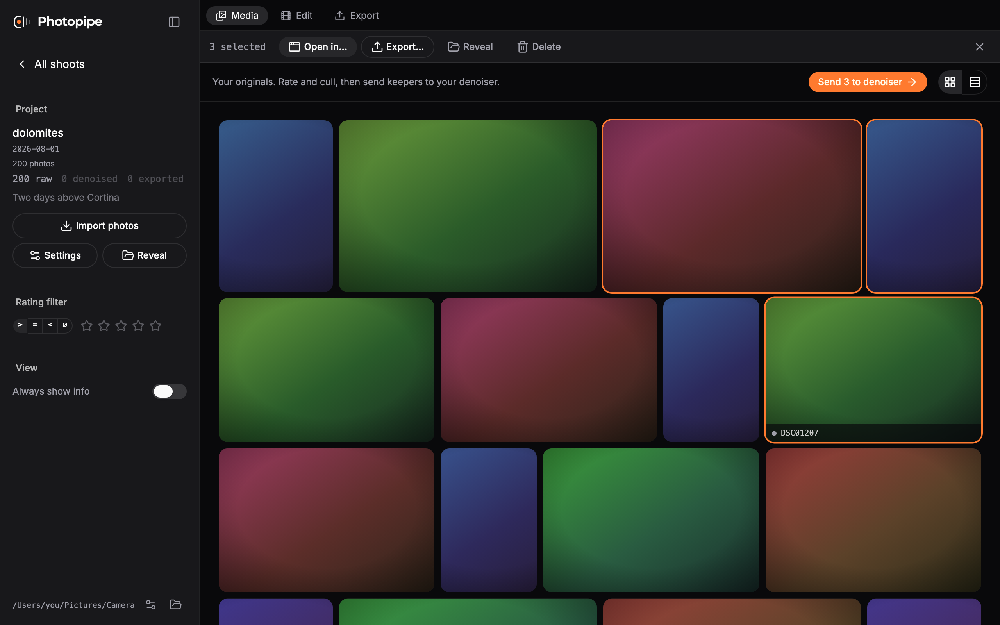

<div align="center">


# Photopipe

Culling and pipeline manager for photo shoots, on macOS.

</div>

Photopipe is for the part of photography that happens between the shoot and
the delivery: looking at a few hundred raws, deciding which ones are worth
keeping, and moving those through denoising, editing and export without
losing track of where anything is.

It is built around one rule: **your folders are the truth.** Photopipe reads
what is on disk and shows it to you. It never maintains a catalogue that can
disagree with reality, and the only files it changes are the ones you ask it
to.



## Install

Requires **macOS 15 (Sequoia) or later** on **Apple Silicon**.

```bash
brew install --cask raphaelmitas/tap/photopipe
```

Or download the DMG from [Releases](https://github.com/RaphaelMitas/photopipe/releases).
Everything is signed and notarized, so it opens with a double-click. There is
nothing else to install: the raw pipeline and the metadata writer ship inside
the app.

## How it works

A project is a folder named `<date>_<name>` with three stage folders inside:

```
2026-07-12_zell/
├── original/     ARW straight off the card
├── processed/    DNG back from your denoiser
└── export/       finished JPEG
```

The app is three workspaces across the top, and you move between them freely.
Nothing is ever "complete", nothing is gated, and no status is stored
anywhere: a photo's stage is simply which folder its files are in.

| Page | What it holds | What it does |
|---|---|---|
| **Media** | your originals | rate, cull, and send keepers to your denoiser |
| **Edit** | the DNGs that came back | open them in your editor |
| **Export** | the finished files | zip them for hand-over |

Processing and editing happen in whatever tools you already use. Photopipe
hands files over and notices what comes back, linking a renamed
`DSC00001-DxO.dng` to the `DSC00001.ARW` it came from.

### Culling


Click a photo to open it full-bleed. Rate with `1`–`5`, clear with `0`,
navigate with `←`/`→`, adjust exposure with `↑`/`↓` to judge a dark frame
fairly. Exposure is preview-only and never touches the file.

Ratings are written as XMP: a sidecar next to a raw, embedded in a DNG or
JPEG. Lightroom, Capture One and Photo Mechanic read the same stars, so
nothing you decide here is locked inside this app.

Hold, or ⌘-click, to start selecting. Then **Open in…**, **Export…**,
**Reveal in Finder**, or **Delete** — which means the Trash, with the whole
lineage group and its sidecars, never an unlink.

## Development

```bash
pnpm install
pnpm --filter desktop tauri dev
```

You need Rust, Swift (Xcode command line tools) and Node 24. `exiftool` comes
from Homebrew in development and is bundled for releases.

```bash
pnpm check                      # lint and format
cd core && swift test           # the Swift core
cd apps/desktop && pnpm test    # component tests
cd apps/desktop && pnpm e2e     # browser e2e against a mocked core
./scripts/smoke-bundle.sh       # prove a built .app is self-contained
```

Releases are cut with `pnpm release [patch|minor|major]`, which opens a PR;
merging it builds, signs, notarizes and publishes. See
[docs/engineering.md](docs/engineering.md).

## Docs

- [docs/design.md](docs/design.md) — what the app is, and the decisions behind it
- [docs/engineering.md](docs/engineering.md) — stack, testing, CI, releases
